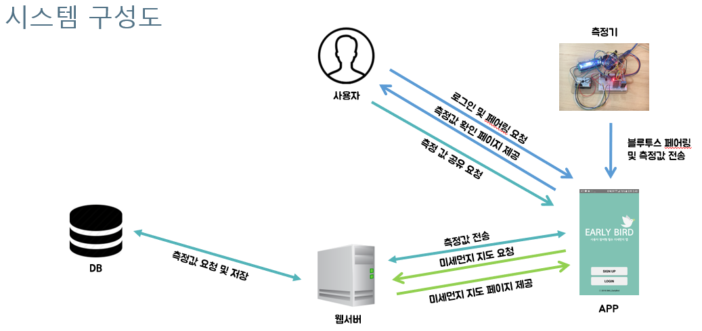
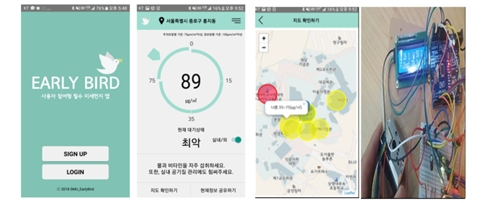
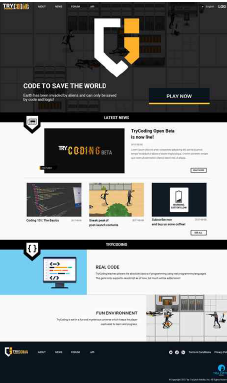
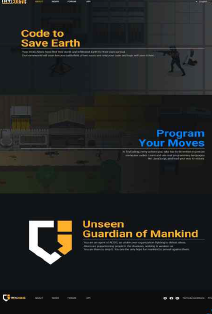
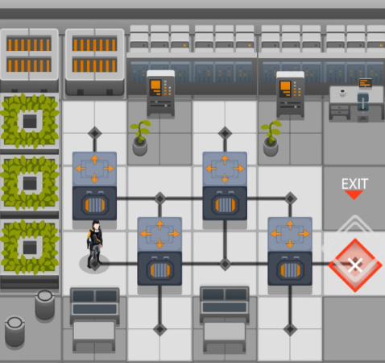
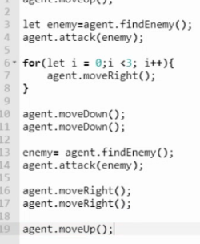
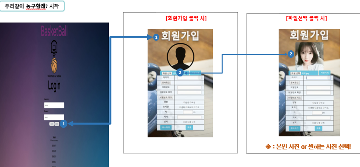
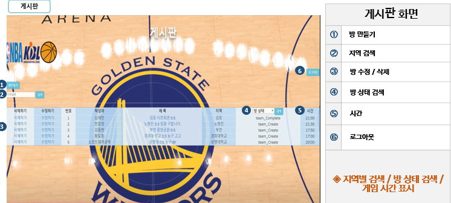
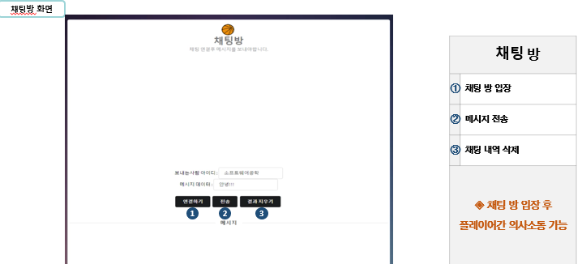

# Resume

**웹 개발 분야**의 관심을 가지고 학부시절 웹프로그래밍 수업과 해당 프로젝트를 진행하면서 프론트앤드와 백앤드 기술을 익혔습니다. 저의 기술역량을 토대로 다수의 사람들에게 가치를 줄 수 있는 sw개발하고 싶습니다.

#### **기본정보**  

| 이름     | 한호정                 |
| -------- | ---------------------- |
| 나이     | 27                     |
| 생년월일 | 1993.02.14             |
| 이메일   | gksghwjd0214@naver.com |
| 휴대폰   | 010-9141-0664          |


#### 학력정보

| 학년   | 학교 이름        | 전공         | 입학년도 | 졸업년도 | 상태 | 최종학력 |
| ------ | ---------------- | ------------ | -------- | -------- | ---- | -------- |
| 대학교 | 상명대학교(서울) | 컴퓨터과학과 | 2013.03  | 2019.02  | 졸업 | 최종     |


## 개발 프로젝트

### <식사하기 좋은 고속도로 휴게소 추천 서비스>

- 소개  

>- **진행기간**: 2018.11.29~11.30
>- **주요내용**: 식사하기 좋은 고속도로 휴게소 추천 서비스
>- **주관기관**: 네이버
>- **사용기술**: FrontEnd(Vue.js), BackEnd(Spring boot,JPA), DB(Mysql) ,CI/CD(git, jenkins,slack)

**개발동기**

한국도로공사에서 제공한 2014년 고속도로 휴게소 이용 실태 조사에 따르면 휴게소 이용 목적 중 식사 목적이 2위(70.1%)로 집계되었습니다. 특정 휴게소에 파는 음식 목록을 알려주는 앱(하이쉼마루)은 존재하지만 단순히 조회한 결과만 보여주어 실질적인 사용자들의 니즈를 충족 시켜주지는 못하고 있습니다. 따라서, 이 문제를 개선하기 위해서 사용자 선호(개인의 취향)와 공공 데이터포털(휴게소 등급, 대표메뉴/계절메뉴,위/경도)의 데이터를 기반으로 분류 기준을 나눈 후, 기준별 가중치를 두어 복합적으로 분석하여 사용자에 맞는 식사하기 가장 적합한 휴게소를 추천해주는 웹 어플리케이션을 개발하였습니다.


**주요 개발기능** 

1. 휴게소 위치 기반 추천 REST API

2. 음식 데이터 기반 기반 추천 REST API

3. Vue.js를 이용한 프론트 구축

4. Jenkins를 이용하여 Front-end배포

   

### <사용자 참여형 미세먼지앱>

- 소개  

> - **진행기간**: 2018.04~2018.9 
> - **주요내용**: 사용자가 직접 미세먼지를 측정하고 이를 공유하는 시스템 개발 
> - **주관기관**: 한국정보산업연합회(한이음ICT) 
> - **사용기술**: FrontEnd(Html, css, js, Android, Leaftlet), BackEnd(Node.js), HW(Arduino uno), DB(Mysql), Tool(git, slack) 

<div>
	</img>
	</img>
</div>


**개발동기**

같은 지역이라도 측정기 위치에 따라 미세먼지 농도 차이가 난다는 기사를 보았습니다. 그러나 실제 환경 관련 앱은 실시간으로 측정 정보를 제공하는 못하는 문제가 있었습니다. 때문에, 많은 사람이 현재 위치한 곳의 공기 질 정보를 정확히 제공 받지 못하는 상황이었습니다.  사용자가 미세먼지를 측정할 수 있는 휴대 가능한 장비를 제작하였고 측정 정보를 상호 교환하는 생태계를 형성할 수 있는 서비스를 구축해 보았습니다.


**주요 개발기능**

1. 미세먼지 측정

   ```
   미세먼지 값 측정의 샤프사의 GP2Y1010AU0F 센서를 이용하여 측정하였습니다. 영점은 PM1.0의 고성능 공기 청정기를 이용하여 보정하였고, 측정방식은 초당 50회 데이터를 측정하고 지수이동평균 방식을 적용하였습니다. 이를 통하여 데이터 신뢰성을 확보할 수 있었습니다.
   ```

2. 소셜 로그인(카카오톡 계정 로그인)/미세먼지 정보 공유하기

   ```
   passport.js와 kakao api를 이용하여 소셜 로그인 기능을 구현하였습니다. 이를 통하여 Oauth2.0 기반의 open api에 대한 이해를 높일 수 있었습니다.
   ```

3. 미세먼지 대처요령 제공

   ```
   미세먼지 측정값을 기준으로
   ```

4. 미세먼지 지도 제공

   ```
   DB에서 측정된 값을 통계를 내어 Leatlet과 ejs를 사용하여 미세먼지 지도 페이지를 구현하였습니다. 이를 통해 DB연동, 동적페이지를 구현할 수 있는 역량을 키웠습니다.
   ```

   


### <웹기반의 코딩학습게임>

- 소개  
> - **진행기간**: 2017.04~2017.11 
> - **주요내용**: 게임을 통해 프로그래밍 언어를 학습하는 게임 개발 
> - **주관기관**: 한국정보산업연합회(한이음ICT 기업주도형 프로젝트) 
> - **사용기술**: FrontEnd(React.js, Scss), BackEnd(Node.js), DB(MongoDB), Tool(Webpack, git) 
> - **수상내역**: 우수 프로젝트 

<div>
	</img>
	</img>
	</img>
	</img>
</div>

**개발동기**

참여했던 공모전은 기업주도형 실무 프로젝트로서 기업의 실무 주제를 기획 제안하여 이  를 대학생 프로젝트팀이 수행하는 방식으로 진행되었습니다. TrycatchMedia라는 웹/모바일 게임 개발에서 코딩학습게임을 개발하였습니다.

**주요 개발 기능**

Ingame, FrontEnd, BackEnd 영역으로 구성되는데  제가 주로 맡은 역할은 React.js,  node.js 를 사용하여 Front-end 영역을 주로 개발하였습니다.  

1. FrontEnd개발

   ```
   사용자가 접속하기 위한 Web 기반의 서비스 사이트로 회원가입, 인증, 개안화, 포럼, 뉴스 레이아웃으로 구성되어 있습니다. 홈페이지 전반의 FrontEnd 개발을 담당하였습니다. 이를 통하여 웹 개발의 환경에 대한 이해와 웹 기술을 성장시킬 수 있었습니다.
   ```

   


## <우리같이 농구할래?>

- 소개  

> - **진행기간**: 2017.04~2017.06 
>
> - **주요내용**: 운동을 좋아하고 즐기는 사람들이 다른 사람과 팀을 구성 할 수 있는 웹 서비스
>
> - **주관기관**: 교내 프로젝트
>
> - **사용기술**: FrontEnd(html,css,jquery), BackEnd(Node.js), DB(Mysql), Tool(git,Asana) 
>
>   

<div>
	</img>
	</img>
	</img>
</div>

**개발동기**

운동을 좋아하고 즐기는 사람은 많지만 개인이 즐길 수 있는 운동이 아닌 팀을 이루어 즐기는 운동을 하기 위해 사람을 모으는 것은 쉬운 일이 아니라는것을 문제로 인식했습니다. 그래서 저희는 이러한 문제를 해결하기 위해 다른 사람과 팀을구성 할 수 있는 웹 서비스를 기획하였습니다.


**주요 개발 기능** 

1. 회원가입/로그인

2. 게시판 기능 구현
3. 게시글 조회(지역/제목/방 상태/시간으로 조회 )
4. 그룹 채팅 기능


## 대외 활동 내역
> 대외 활동

| 커뮤니티명                  | 기간             |
| --------------------------- | ---------------- |
| 네이버 해커톤               | 2018.11.27~11.28 |
| 한이음ICT                   | 2018.04~2018.9   |
| 한이음ICT                   | 2017.04~2017.11  |
| 교내 안드로이드 어플 동아리 | 2016.09~2016.12  |


> 교육 이수

| 교육 명               | 기간                  | 주요 내용                                              |
| --------------------- | --------------------- | ------------------------------------------------------ |
| 백준 알고리즘 특강    | 2018.12.26~2018.12.28 | 기초 알고리즘 학습(그래프, 다이나믹,브루트 포스)       |
| Java Programming 과정 | 2017.01.02~2016.01.22 | 자바 프로그램을 객체지향적으로 만드는 방법에 대한 학습 |


### 소셜

| Site   | URL                          |
| ------ | ---------------------------- |
| Github | https://github.com/HanHoJung |

---
